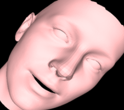
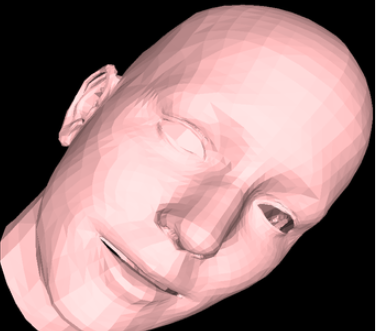
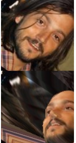

## 300wlp dataset face profiling 

这个仓库提供了一些代码帮助实现300wlp 数据集的人脸旋转, 可以生成人脸沿xyz轴的图片, 可以帮助实现数据增广.

## 环境设置
仓库依赖了[BFM_to_FLAME](https://github.com/TimoBolkart/BFM_to_FLAME.git), [photometric_optimization](https://github.com/zengxianyu/photometric_optimization.git)和[3DDFA](https://github.com/cleardusk/3DDFA.git)三个代码仓库, 不过3DDFA只依赖部分代码片段, 主要参考**BFM_to_FLAME**和**photometric_optimization**的readme来配置环境即可.

## 数据准备
请参考[3DFFA]readme分别下载**train.configs**, **train_aug_120x120.zip**和**test.data.zip**, 解压后放在同一个文件夹里, 文件夹改为**300wlp_mini**

## 旋转300wlp数据集

1. 将300wlp人脸模型fit成flame 人头模型

```bash
python convert_300wlp_to_flame.py
```
程序会读取人脸参数转换为bfm人脸模型, 然后与flame 人头模型fit, 最终会将fit好的人头模型保存下来.
读取图片:  


bfm人脸模型:


fit 好的flame 人头模型


2. 旋转人头模型

```bash
python profiling_falme_head_model.py
```
这个阶段会加载步骤1中生成的人头模型, 同时从图片上获取人脸的纹理信息, 通过不同姿态下的相机对人脸进行投影, 通过调整**aug_angles**可以生成不同姿态的人脸,示意图如下:

- roll方向的旋转


- pitch方向旋转


## 旋转任意人脸

如果想旋转任意人脸可以使用3ddfa仓库推理出人脸的shape和expresion参数,然后在使用上面的脚本旋转人脸